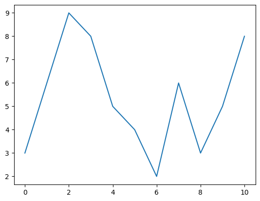
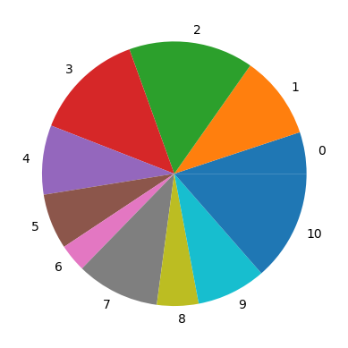
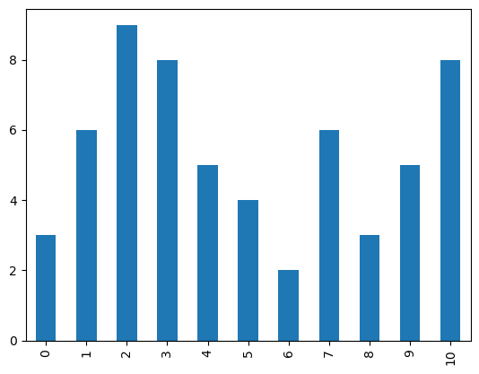
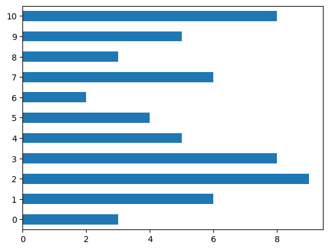
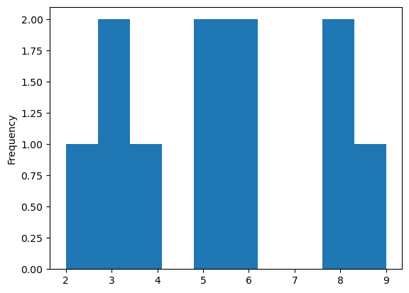
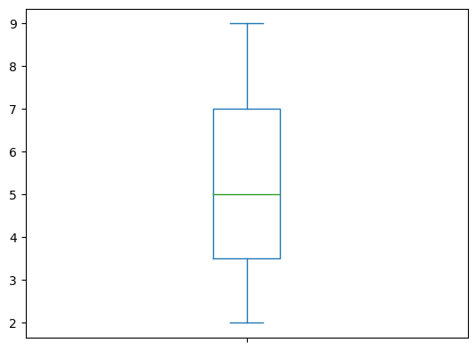
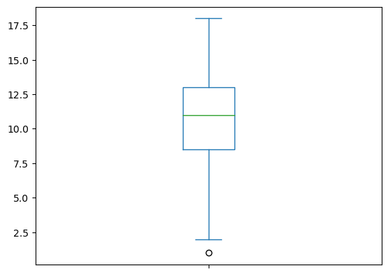
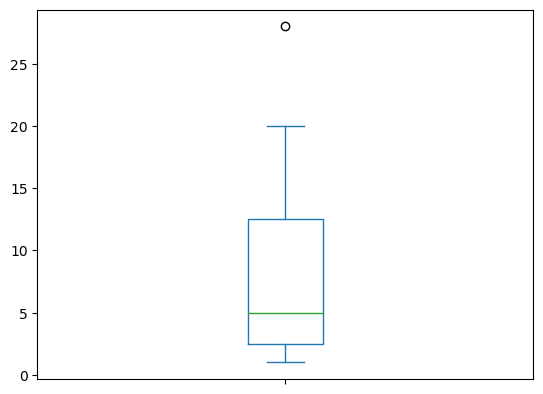
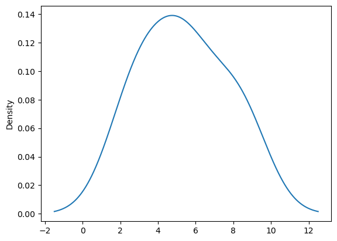
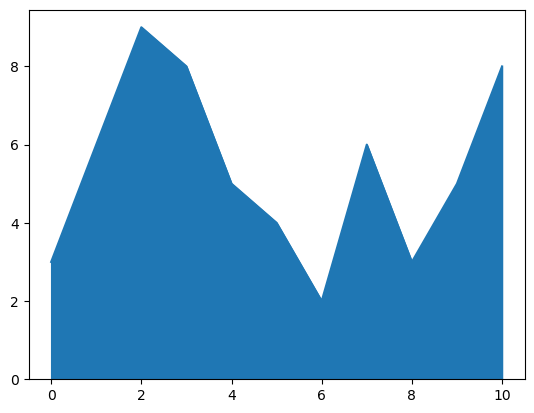

# pandas
### Panel Date Analysis 


```python
#import pandas 
import pandas as pd
```

## Create a one-dimensional matrix 


```python
data = pd.Series([0.25,0.5,0.75,1.0])
#############################################
#data = pd.Series((0.25,0.5,0.75,1.0))
############################################
print(data)
```

    0    0.25
    1    0.50
    2    0.75
    3    1.00
    dtype: float64
    


```python
print(data.values)
```

    [0.25 0.5  0.75 1.  ]
    


```python
print(data.index)
```

    RangeIndex(start=0, stop=4, step=1)
    


```python
print(data.keys)
```

    <bound method Series.keys of 0    0.25
    1    0.50
    2    0.75
    3    1.00
    dtype: float64>
    

# Describe()


```python
data = pd.Series((3,6,9,8,5,4,2,6,3,5,8))
print(data.describe())
```

    count    11.000000
    mean      5.363636
    std       2.292280
    min       2.000000
    25%       3.500000
    50%       5.000000
    75%       7.000000
    max       9.000000
    dtype: float64
    

### If you do not want to show everything in the Describe and want specific things


```python
data = pd.Series((3,6,9,8,5,4,2,6,3,5,8))
print(data.agg(['max','min','sum','mean','std']))
```

    max      9.000000
    min      2.000000
    sum     59.000000
    mean     5.363636
    std      2.292280
    dtype: float64
    

### working with Series as a last 


```python
print(data[1])
print(data[1:6])
print(data[1:8:2])
```

    6
    1    6
    2    9
    3    8
    4    5
    5    4
    dtype: int64
    1    6
    3    8
    5    4
    7    6
    dtype: int64
    

## Can I make the index myself


```python
data1 = pd.Series([1,2,3,4],index=['a','b','c','d'])

#data1 = pd.Series([1,2,3,4],['a','b','c','d'])

######################################################
data2 = pd.Series({'a':1,'b':2,'c':3,'D':4})


print(data1)
print(data2)
```

    a    1
    b    2
    c    3
    d    4
    dtype: int64
    a    1
    b    2
    c    3
    D    4
    dtype: int64
    

## Make a List


```python
x = pd.Index([2,3,5,7,11])

print(x)
```

    Index([2, 3, 5, 7, 11], dtype='int64')
    

## make a math logic 


```python
import pandas as pd

a = pd.Index([1, 3, 5, 7, 9])
b = pd.Index([2, 3, 5, 7, 11])

print(a)  # Print the index a
print(b)  # Print the index b

print(a.intersection(b))  # Intersection of a and b
print(a.union(b))         # Union of a and b
print(a.symmetric_difference(b))  # Symmetric difference of a and b

```

    Index([1, 3, 5, 7, 9], dtype='int64')
    Index([2, 3, 5, 7, 11], dtype='int64')
    Index([3, 5, 7], dtype='int64')
    Index([1, 2, 3, 5, 7, 9, 11], dtype='int64')
    Index([1, 2, 9, 11], dtype='int64')
    


```python

```
# Data visualization


```python
import pandas as pd 
data = pd.Series((3,6,9,8,5,4,2,6,3,5,8))

data.plot()
#data.plot(kind='line')
```


    <Axes: >


    

    


X --> Keys

Y --> values


```python
data.plot(kind='pie')
```


    <Axes: >


    

    


```python
data.plot(kind='bar')
```


    <Axes: >


    

    


```python
data.plot(kind='barh')
```


    <Axes: >


    

    


```python
data.plot(kind='hist')
```


    <Axes: ylabel='Frequency'>


    

    


```python
data = pd.Series((3,6,9,8,5,4,2,6,3,5,8))
data.plot(kind='box')
```


    <Axes: >


    

    


```python
data = pd.Series((1,2,9,8,10,11,12,12,14,15,18))
data.plot(kind='box')
```


    <Axes: >


    

    


```python
data = pd.Series((1,2,3,4,5,6,7,1,18,20,28))
data.plot(kind='box')
```


    <Axes: >


    

    


```python
data = pd.Series((3,6,9,8,5,4,2,6,3,5,8))
data.plot(kind='kde')
```


    <Axes: ylabel='Density'>


    

    


```python
data = pd.Series((3,6,9,8,5,4,2,6,3,5,8))
data.plot(kind='density')
```


    <Axes: ylabel='Density'>


    

    


```python
data.plot(kind='area')
```


    <Axes: >


    

    

